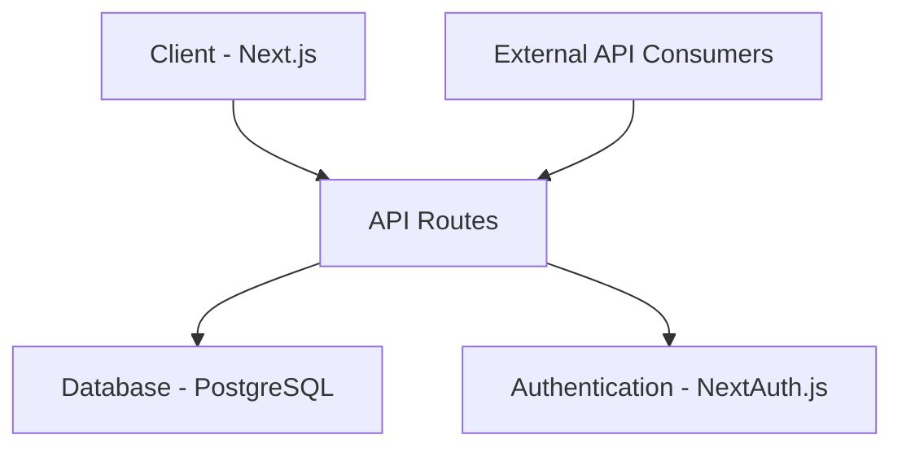
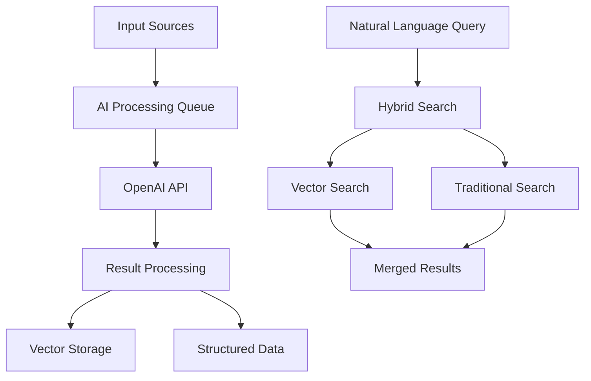

# Personal Relationship Manager (PRM) MVP Requirements

## Executive Summary
### Problem Statement
Users struggle to maintain meaningful relationships due to the cognitive overhead of tracking interactions, important details, and follow-ups. Current solutions require too much manual data entry and don't provide actionable insights.

### Solution Overview
An enhanced markdown-based system that allows for unstructured note-taking while providing basic organization and reminder capabilities. The MVP will focus on core relationship management features without complex AI integration.

### Target Outcomes (6 months)
- Users maintain more consistent contact with their key relationships
- Reduced cognitive load in tracking relationship details
- Improved quality of interactions through better context retention

## MVP Core Requirements (v1.0)

### 1. Data Storage & Organization
- Single markdown file system for storing contact information and notes
- Git-based version control for history tracking
- Basic tag-based organization (#tags)
- Simple search functionality
- Private/shared section demarcation

### 2. Contact Management
```markdown
# Contact Entry Format
## [Contact Name]
Tags: #tier1 #family #boston
Last Contact: 2024-03-20
Next Due: 2024-04-20

### Basic Info
- Email: example@email.com
- Phone: (555) 555-5555
- Location: Boston, MA

### Notes
- [2024-03-20] Had coffee, discussed new job at Tech Co
- [2024-02-15] Birthday celebration at Italian restaurant

### Important Dates
- Birthday: January 15
- Anniversary: March 30

### Action Items
- [ ] Send congratulations card for new job
- [ ] Share article about Boston tech scene
```

### 3. Core Features
- Basic CRUD operations for contacts
- Simple tagging system (#tier1, #family, etc.) to form groups
- Last contact date tracking
- Next contact due date calculation
- Basic reminder system for upcoming due dates
- Important dates tracking (birthdays, anniversaries)
- Action item tracking
- Basic search functionality

### 4. User Interface
- Markdown editor with preview
- Simple web interface for viewing/editing
- Mobile-responsive design
- Basic filtering by tags
- Simple search interface

### Technical Requirements
```javascript
// Core Data Structure
interface Contact {
  name: string;
  tags: string[];
  lastContact: Date;
  nextDue: Date;
  basicInfo: {
    email?: string;
    phone?: string;
    location?: string;
  };
  notes: Note[];
  importantDates: ImportantDate[];
  actionItems: ActionItem[];
}

interface Note {
  date: Date;
  content: string;
  isPrivate: boolean;
}

interface ImportantDate {
  label: string;
  date: Date;
  recurring: boolean;
}

interface ActionItem {
  description: string;
  dueDate?: Date;
  completed: boolean;
}
```

## Future Versions

### v1.5 Enhancements
- Basic email integration
- Calendar sync for important dates
- Multi-file organization
- Enhanced search capabilities
- Basic contact import/export

### v2.0 Features (AI Integration)
- AI processing of unstructured notes
- Automated tagging suggestions
- Smart reminder system
- Relationship insight generation
- External data integration (social media, news)

## Implementation Guidelines

### MVP Development Phases

1. Core Data Structure (Week 1-2)
- Implement markdown parser
- Set up Git repository
- Create basic data models
- Implement file storage system

2. Basic UI (Week 3-4)
- Create markdown editor interface
- Implement basic search
- Add tag filtering
- Build mobile-responsive layout

3. Core Features (Week 5-6)
- Add CRUD operations
- Implement tagging system
- Build reminder system
- Add important dates tracking

4. Testing & Polish (Week 7-8)
- User testing
- Bug fixes
- Performance optimization
- Documentation

### Technical Stack Recommendations
- Frontend: Next.js or React
- Storage: Local filesystem with Git
- Parser: Markdown-it or similar
- Search: Simple text-based search initially
- Styling: Tailwind CSS
- Deployment: Vercel or Netlify

### MVP Success Metrics
- Daily active users
- Number of contacts managed
- Number of notes added
- Reminder response rate
- Search usage
- User retention after 1 month

## Development Priorities

### Must-Have (MVP)
1. Contact information storage
2. Basic note-taking
3. Simple tagging system
4. Important dates tracking
5. Basic search
6. Mobile access
7. Reminder system

### Nice-to-Have (Post-MVP)
1. Email integration
2. Calendar sync
3. Contact import/export
4. Advanced search
5. Multi-user support
6. API access

### V2 Features
1. AI processing
2. External data integration
3. Automated insights
4. Smart suggestions
5. Integration platform support

This MVP focuses on creating a solid foundation with basic functionality that can be built upon. The markdown-based approach allows for quick implementation while maintaining flexibility for future enhancements. 

## Technical Architecture

### Technology Stack
- **Frontend**: Next.js 14+ with TypeScript
- **Backend**: Next.js API Routes with TypeScript
- **Database**: PostgreSQL
- **ORM**: Prisma
- **Authentication**: NextAuth.js
- **API Documentation**: OpenAPI/Swagger
- **Testing**: Jest + React Testing Library
- **Deployment**: Vercel

### Database Schema (Prisma)
```prisma
model User {
  id            String    @id @default(cuid())
  email         String    @unique
  name          String?
  contacts      Contact[]
  createdAt     DateTime  @default(now())
  updatedAt     DateTime  @updatedAt
}

model Contact {
  id            String    @id @default(cuid())
  userId        String
  user          User      @relation(fields: [userId], references: [id])
  name          String
  email         String?
  phone         String?
  location      String?
  tags          Tag[]
  notes         Note[]
  importantDates ImportantDate[]
  actionItems   ActionItem[]
  lastContact   DateTime?
  nextDue       DateTime?
  createdAt     DateTime  @default(now())
  updatedAt     DateTime  @updatedAt

  @@index([userId])
}

model Tag {
  id        String    @id @default(cuid())
  name      String
  contacts  Contact[]
  createdAt DateTime  @default(now())
  updatedAt DateTime  @updatedAt

  @@unique([name])
}

model Note {
  id        String   @id @default(cuid())
  contactId String
  contact   Contact  @relation(fields: [contactId], references: [id])
  content   String   @db.Text
  isPrivate Boolean  @default(false)
  date      DateTime
  createdAt DateTime @default(now())
  updatedAt DateTime @updatedAt

  @@index([contactId])
}

model ImportantDate {
  id          String   @id @default(cuid())
  contactId   String
  contact     Contact  @relation(fields: [contactId], references: [id])
  label       String
  date        DateTime
  recurring   Boolean  @default(false)
  createdAt   DateTime @default(now())
  updatedAt   DateTime @updatedAt

  @@index([contactId])
}

model ActionItem {
  id          String    @id @default(cuid())
  contactId   String
  contact     Contact   @relation(fields: [contactId], references: [id])
  description String
  dueDate     DateTime?
  completed   Boolean   @default(false)
  createdAt   DateTime  @default(now())
  updatedAt   DateTime  @updatedAt

  @@index([contactId])
}
```

### API Structure

#### RESTful Endpoints
```typescript
// Base API URL: /api/v1

// Contacts
GET     /contacts              // List contacts
POST    /contacts              // Create contact
GET     /contacts/:id          // Get contact
PUT     /contacts/:id          // Update contact
DELETE  /contacts/:id          // Delete contact
GET     /contacts/:id/notes    // Get contact notes
POST    /contacts/:id/notes    // Add contact note

// Tags
GET     /tags                  // List tags
POST    /tags                  // Create tag
DELETE  /tags/:id              // Delete tag

// Important Dates
GET     /dates                 // List important dates
POST    /dates                 // Create important date
PUT     /dates/:id             // Update important date
DELETE  /dates/:id             // Delete important date

// Action Items
GET     /actions              // List action items
POST    /actions              // Create action item
PUT     /actions/:id          // Update action item
DELETE  /actions/:id          // Delete action item
```

### Security Requirements
- JWT-based authentication
- Rate limiting for API endpoints
- CORS configuration for API access
- Input validation using Zod
- Request sanitization
- API key management for external access

### Development Guidelines
1. **API First Development**
   - All features must be implemented API-first
   - Complete OpenAPI documentation required
   - API versioning from day one
   - Comprehensive endpoint testing

2. **Type Safety**
   - Strict TypeScript configuration
   - Shared types between frontend and API
   - Zod schemas for validation
   - Type generation from Prisma schema


### Deployment Architecture


### Infrastructure Requirements
- PostgreSQL database with automated backups
- Vercel deployment with preview environments
- Database migration strategy
- Monitoring and logging setup
- CI/CD pipeline configuration 


### For Later

1. **Testing Requirements**
   - Unit tests for API endpoints
   - Integration tests for database operations
   - E2E tests for critical user flows
   - Minimum 80% test coverage

2. **Performance Requirements**
   - API response time < 200ms
   - Page load time < 1.5s
   - Database query optimization
   - Proper indexing strategy

## AI Integration Architecture

### OpenAI Integration Layer
```typescript
interface AIProcessor {
  // Core Processing
  processUnstructuredInput(input: string): Promise<ParsedContactData>;
  generateSearchEmbeddings(text: string): Promise<number[]>;
  
  // Feature-Specific Processing
  analyzeEmail(email: string): Promise<EmailAnalysis>;
  suggestTags(contactData: ContactData): Promise<string[]>;
  generateReminders(contactHistory: ContactHistory): Promise<ReminderSuggestion[]>;
  suggestValueAdd(contact: Contact): Promise<ValueAddSuggestion[]>;
  
  // Natural Language Search
  semanticSearch(query: string): Promise<SearchResult[]>;
}

interface AIProcessingQueue {
  queueType: 'email' | 'contact' | 'reminder' | 'search';
  priority: number;
  data: any;
  status: 'pending' | 'processing' | 'completed' | 'failed';
}
```

### Vector Search Implementation
```prisma
// Add to existing Prisma schema

model ContactEmbedding {
  id          String   @id @default(cuid())
  contactId   String
  contact     Contact  @relation(fields: [contactId], references: [id])
  embedding   Float[]  // Vector representation
  content     String   // Original text content
  createdAt   DateTime @default(now())
  updatedAt   DateTime @updatedAt

  @@index([contactId])
}

model NoteEmbedding {
  id          String   @id @default(cuid())
  noteId      String
  note        Note     @relation(fields: [noteId], references: [id])
  embedding   Float[]  // Vector representation
  createdAt   DateTime @default(now())
  updatedAt   DateTime @updatedAt

  @@index([noteId])
}
```

### AI Feature Requirements

#### 1. Natural Language Search
- Vector embeddings for contacts and notes using OpenAI embeddings API
- Postgres pgvector extension for vector similarity search
- Hybrid search combining traditional and semantic search
- Search ranking and relevance scoring
- Search result highlighting and context

#### 2. Unstructured Input Processing
- Email parsing and content extraction
- Contact information extraction from various formats
- Relationship context identification
- Sentiment analysis for interactions
- Key topic extraction

#### 3. Intelligent Tagging
- Automated tag suggestions based on contact context
- Relationship strength assessment
- Interest and topic extraction
- Professional domain identification
- Location-based tagging

#### 4. Smart Reminders
- Context-aware reminder generation
- Follow-up suggestion timing
- Priority level assessment
- Custom reminder templates
- Interaction cadence optimization

#### 5. Value-Add Suggestions
- Gift recommendations based on interests
- Content sharing suggestions
- Event recommendations
- Conversation topic suggestions
- Professional opportunity matching

### AI Processing Architecture


### AI Implementation Guidelines

#### 1. Processing Pipeline
```typescript
// Example processing pipeline
interface ProcessingPipeline {
  stages: {
    preProcess: (input: any) => Promise<any>;
    aiProcess: (prepared: any) => Promise<any>;
    postProcess: (result: any) => Promise<any>;
    store: (processed: any) => Promise<void>;
  };
  errorHandling: {
    retry: boolean;
    maxAttempts: number;
    fallback: (error: Error) => Promise<void>;
  };
}
```

#### 2. Rate Limiting & Optimization
- Implement token usage tracking
- Batch processing for cost optimization
- Caching of common AI operations
- Fallback mechanisms for API failures
- Progressive enhancement of features

#### 3. Data Privacy & Security
- AI processing audit logs
- Personal data filtering before AI processing
- Encrypted storage of AI results
- User consent management
- Data retention policies

### API Endpoints for AI Features
```typescript
// Base API URL: /api/v1/ai

// Search
POST    /search              // Natural language search
POST    /search/hybrid       // Combined traditional and semantic search

// Processing
POST    /process/email       // Process email content
POST    /process/contact     // Process contact information
POST    /suggest/tags        // Get tag suggestions
POST    /suggest/reminders   // Get reminder suggestions
POST    /suggest/valueadd    // Get value-add suggestions

// Analytics
GET     /analytics/topics    // Get topic analysis
GET     /analytics/sentiment // Get sentiment analysis
GET     /analytics/network   // Get network analysis
```

### Vector Search Query Example
```sql
-- Using pgvector extension
SELECT c.*, 
       1 - (c_embed.embedding <=> query_embedding) as similarity
FROM contacts c
JOIN contact_embeddings c_embed ON c.id = c_embed.contact_id
WHERE 1 - (c_embed.embedding <=> query_embedding) > 0.7
ORDER BY similarity DESC
LIMIT 5;
```

### Infrastructure Updates
- PostgreSQL with pgvector extension
- Redis for AI result caching
- Background job processing for AI tasks
- Monitoring for AI API usage and costs
- Separate processing queues for different AI operations
```

### AI Processing Pipeline
```typescript
interface UnstructuredInput {
  type: 'voice' | 'text' | 'email' | 'image';
  content: string | Buffer;
  timestamp: Date;
  context?: {
    location?: string;
    device?: string;
    relatedContacts?: string[];
  };
}

interface ProcessedAction {
  type: ActionType;
  confidence: number;
  suggestedChanges: SystemChange[];
  rawInput: UnstructuredInput;
  processedContent: {
    entities: ExtractedEntity[];
    relationships: RelationshipContext[];
    actionItems: ActionItem[];
    topics: Topic[];
  };
  status: 'pending' | 'approved' | 'executed' | 'rejected';
}

interface SystemChange {
  action: 'create' | 'update' | 'delete';
  model: 'Contact' | 'Note' | 'ActionItem' | 'ImportantDate';
  data: any;
  undoAction?: () => Promise<void>;
}

interface ValueAddSuggestion {
  contactId: string;
  type: 'article' | 'event' | 'restaurant' | 'gift' | 'content';
  relevance: number;
  source: string;
  context: string;
  suggestedAction: string;
  relatedNotes: string[];
  expirationDate?: Date;
}
```

### Intelligent Input Processing

#### 1. Voice Note Processing
```typescript
// Voice Processing Pipeline
interface VoiceProcessingPipeline {
  stages: {
    transcription: (audio: Buffer) => Promise<string>;
    understanding: (text: string) => Promise<ProcessedContent>;
    actionExtraction: (content: ProcessedContent) => Promise<SystemChange[]>;
    verification: (changes: SystemChange[]) => Promise<ProcessedAction>;
    execution: (action: ProcessedAction) => Promise<void>;
  };
  settings: {
    autoExecute: boolean;
    confidenceThreshold: number;
    requireApproval: boolean;
  };
}
```

#### 2. Unstructured Text Analysis
- Entity extraction (people, places, dates)
- Action item identification
- Relationship context understanding
- Topic classification
- Sentiment analysis
- Priority assessment

#### 3. Automated Action Generation
```typescript
interface ActionGenerator {
  generateActions(input: ProcessedContent): Promise<SystemChange[]>;
  validateActions(changes: SystemChange[]): Promise<ValidationResult>;
  executeActions(changes: SystemChange[]): Promise<ExecutionResult>;
  undoActions(executionId: string): Promise<void>;
}
```

### Proactive Relationship Management

#### 1. Interaction Suggestions
```typescript
interface InteractionEngine {
  // Core suggestion generation
  generateSuggestions(contactId: string): Promise<ValueAddSuggestion[]>;
  
  // Context gathering
  gatherContactContext(contactId: string): Promise<ContactContext>;
  findRelevantContent(context: ContactContext): Promise<ContentSuggestion[]>;
  
  // External integrations
  searchLocalEvents(location: string, interests: string[]): Promise<Event[]>;
  findRelevantArticles(topics: string[]): Promise<Article[]>;
  searchLocalBusinesses(type: string, location: string): Promise<Business[]>;
}

interface ContactContext {
  recentInteractions: Interaction[];
  interests: string[];
  location: string;
  importantDates: ImportantDate[];
  relationshipStrength: number;
  topicHistory: Topic[];
  preferences: Preference[];
}
```

#### 2. External Content Integration
```typescript
interface ContentProvider {
  // News and Articles
  searchNews(query: string): Promise<Article[]>;
  findRelevantContent(topics: string[]): Promise<Content[]>;
  
  // Local Discovery
  searchEvents(location: string, type: string): Promise<Event[]>;
  findVenues(type: string, location: string): Promise<Venue[]>;
  
  // Social Media
  getPublicUpdates(platform: string, identifier: string): Promise<Update[]>;
}
```

### API Endpoints for Unstructured Input
```typescript
// Base API URL: /api/v1/input

// Voice Processing
POST    /voice/process           // Process voice note
POST    /voice/transcribe        // Just transcription

// Text Processing
POST    /text/process           // Process unstructured text
POST    /text/analyze           // Analyze without actions

// Action Management
POST    /actions/generate       // Generate suggested actions
POST    /actions/execute        // Execute approved actions
POST    /actions/undo/:id       // Undo specific action

// Suggestions
GET     /suggest/interactions   // Get interaction suggestions
GET     /suggest/content        // Get content suggestions
GET     /suggest/valueadd       // Get value-add opportunities
```

### Implementation Example
```typescript
// Example of processing flow
async function processVoiceNote(audio: Buffer): Promise<ProcessedAction> {
  // 1. Transcribe audio
  const text = await openai.transcribe(audio);
  
  // 2. Analyze content
  const analysis = await openai.analyze(text, {
    extractEntities: true,
    identifyActions: true,
    assessPriority: true
  });
  
  // 3. Generate suggested changes
  const suggestions = await actionGenerator.generateActions(analysis);
  
  // 4. Validate changes
  const validated = await actionGenerator.validateActions(suggestions);
  
  // 5. Execute or queue for approval
  if (validated.confidence > settings.autoExecuteThreshold) {
    return await actionGenerator.executeActions(validated.changes);
  } else {
    return await queueForApproval(validated);
  }
}
```

### Background Processing System
```typescript
interface BackgroundProcessor {
  // Scheduled Tasks
  scheduleInteractionReview(frequency: 'daily' | 'weekly'): Promise<void>;
  scheduleContentDiscovery(contactId: string): Promise<void>;
  
  // Event Handlers
  onNewNote(note: Note): Promise<void>;
  onLocationChange(contact: Contact): Promise<void>;
  onImportantDate(date: ImportantDate): Promise<void>;
  
  // Content Generation
  generateInteractionSuggestions(): Promise<void>;
  updateContactContext(): Promise<void>;
  refreshExternalContent(): Promise<void>;
}